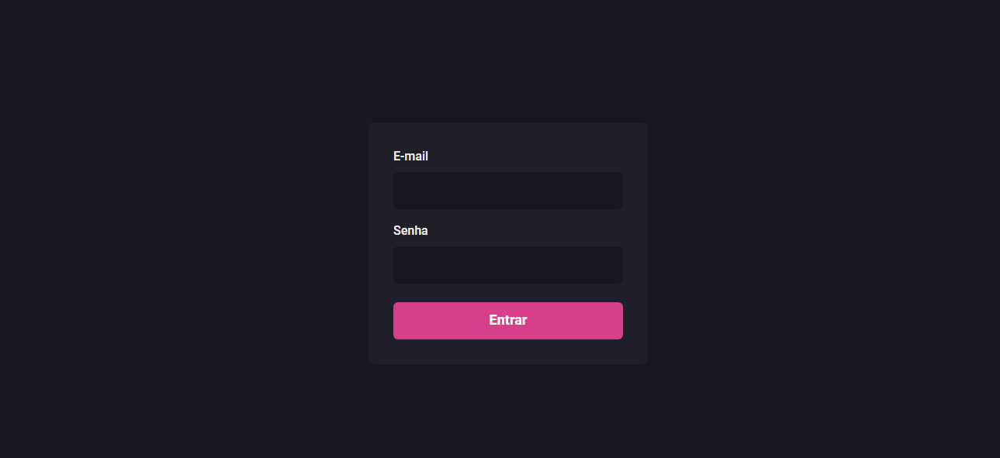
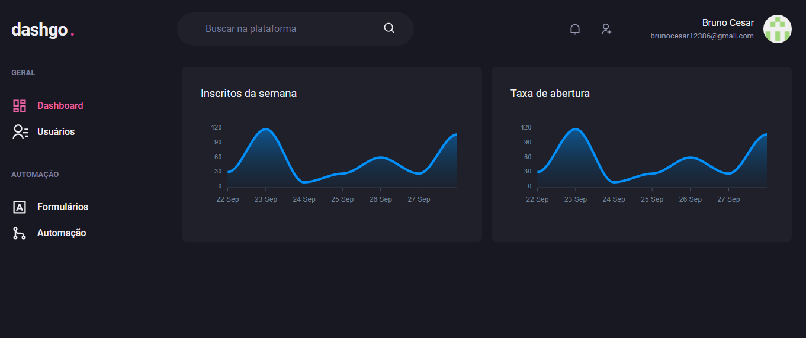
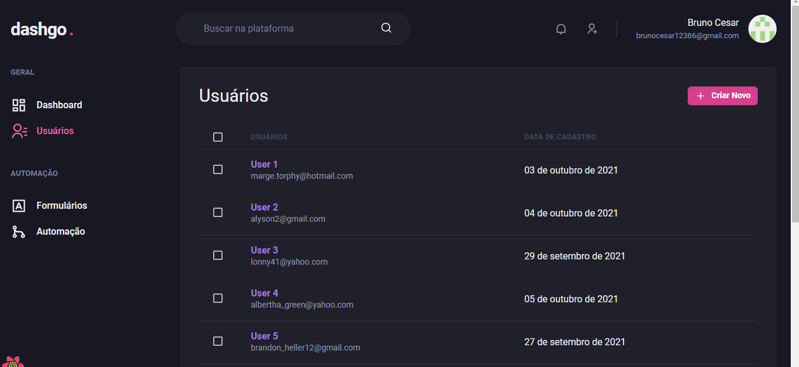
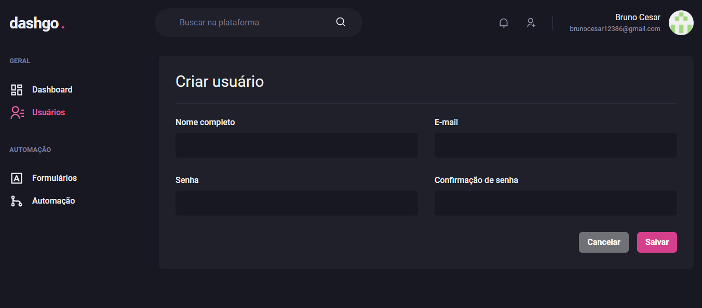

# DASHGO.

Projeto consiste em um dashboard desenvolvido com interface declarativa.

## Demonstração do projeto






## 🛠 Tecnologias

* [**Nodejs**](https://nodejs.org/en/)
* [**Reactjs**](https://pt-br.reactjs.org/)
* [**Typescript**](https://www.typescriptlang.org/)
* [**Nextjs**](https://nextjs.org/)
* [**ChakraUI**](https://chakra-ui.com/)
* [**React-query**](https://react-query.tanstack.com/)
* [**ApexCharts**](https://apexcharts.com/)

## 🎲 Rodando o Projeto

```bash
# Clone este repositório
$ git clone https://github.com/Bruno-Cesar123/dashgo.git

# Acesse a pasta do projeto no terminal/cmd
$ cd dashgo

# Instale as dependências
$ npm install ou yarn

# Execute a aplicação em modo de desenvolvimento
$ npm run dev ou yarn dev

# O servidor inciará na porta:3000 - acesse <http://localhost:3000>
```

## 📝 Licença

Este projeto esta sobe a licença MIT.

Feito por **Bruno Cesar** [**LinkedIn**](https://www.linkedin.com/in/bruno-cesar-b0039715a/)
